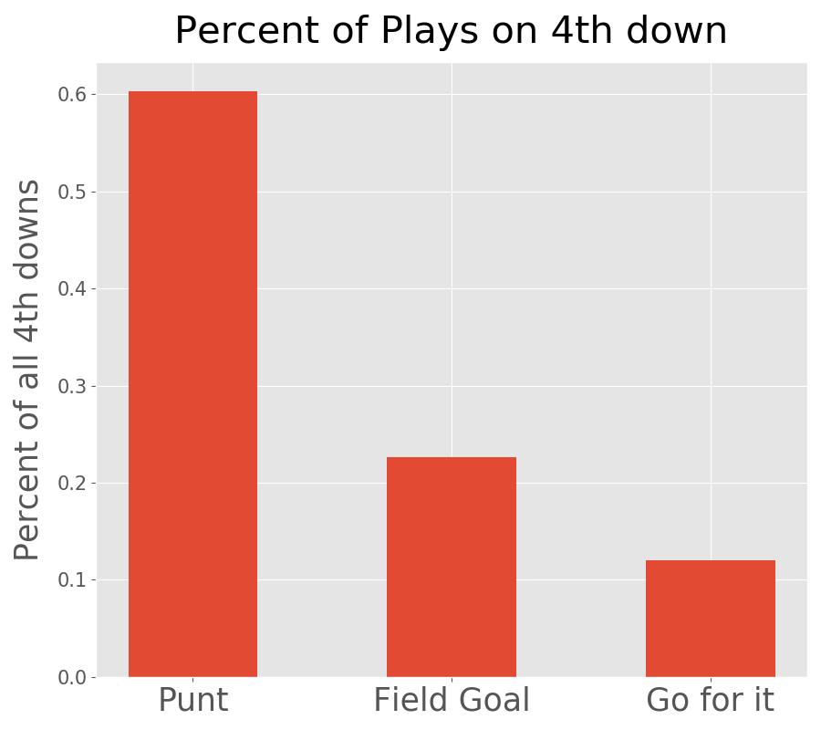
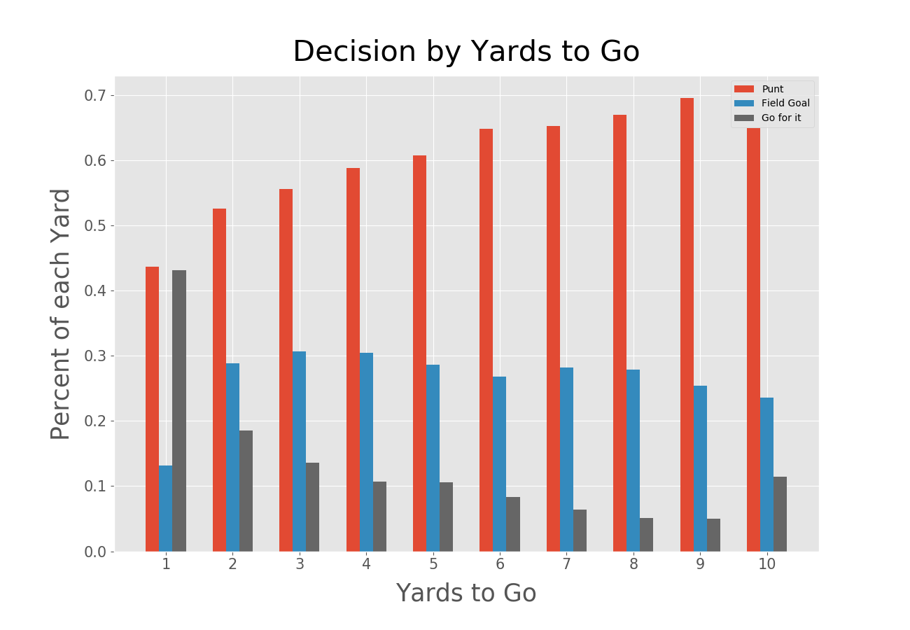
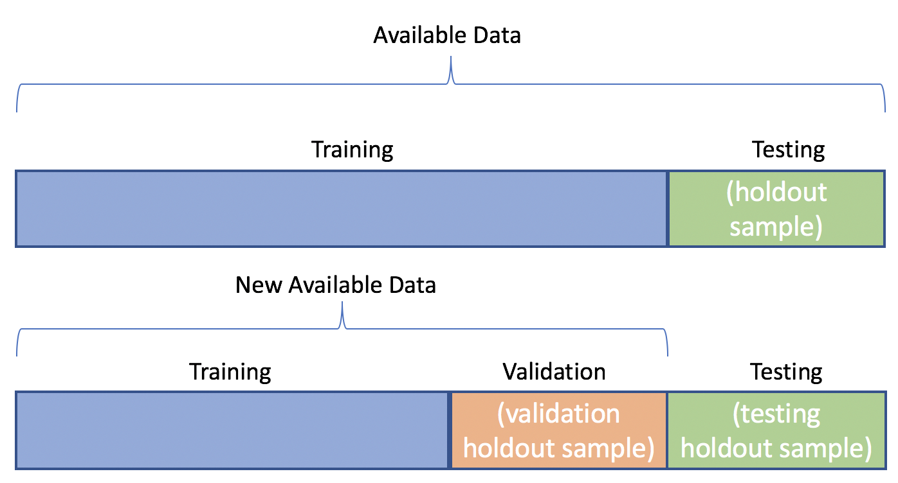

# NFL Advanced Analytics on 4th down 

Time and time again we hear about coaches punting or kicking a field goal on 4th down just to hear later that they should have gone for it. So when should they really go for it? Using the combination of Exploratory Data Analysis and Machine Learning, I aim to build a model that takes into account the field position, the drive, the quarter, and anything else you can think of to predict whether or not a team is going to Punt, Kick a Field Goal, or Go for it on 4th down. 

### Table of Contents

1. [Overview](#overview)
2. [Goals](#goals)
3. [Data](#data)
4. [Analysis](#ana)
5. [Models](#model)
6. [Conclusion](#conclusion)

## 1. Overview

Need a quick refresher? Check out this [video...](https://www.youtube.com/watch?v=3t6hM5tRlfA).

4th downs are considered a very important part of football. You can either add to your score or give the ball away to the other team at a worse field position. Coaches tend to be very, very conservative when it comes to "Going for it" on 4th down. Even sometimes when statistically Going for it is in their favor. I want to educate fans and coaches about their options on 4th down and what the best decision is. 

## 2. Goals

**Using Exploratory Data Analysis and Machine Learning, this study predicts deicion making on 4th down and provides insight into what the outcomes could be if coaching tatics were adjusted.**

My long term goals: 
I want to use the research and analyses I have done to revolutionalize sports using Big Data. As a woman and a data scientist, I love bringing my skills and my passions to this male dominanted industry. So much more needs to be done and we will never know the advances we can make unless we do work similar to this study. 

## 3. Data

Thanks to Maksim Horowitz, Ron Yurko, and Sam Ventura, this data is publicly available on [Kaggle](https://www.kaggle.com/maxhorowitz/nflplaybyplay2009to2016). 
From the 2009 to the 2018 regular season, this dataset contains 449,371 rows (individual plays) and 255 columns (features). 

|Entire Dataset |                
|-----------------------------|             
|449371 individual plays|          
|255 features|                     
|2009 - 2018 regular seasons|     
|2,526 games|                          
|37,769 4th down plays|                       

**Pipeline**
The process for reading in the data for EDA purposes 
- CSV read in using pandas specifying low memory due to the size of the file. 
                  
`pd.read_csv('NFL_playbyplay.csv', low_memory=False)` 

- In order to do EDA on 4th down plays a lot of cleaning was involved:
  1. Specified all 4th down plays
  2. Got rid of plays that had penalties
  3. Changed data type of date features and created new feature engineered columns like year and month 
  4. Got rid of plays that were the last of the quarter

## 4. Analysis
The best part about this project was the EDA. Finding what influences 4th down and the analyzing the discrepencies about which plays happen when was fascinating. We will take a look at some of those findings here.  

Its no secret that Punting is far more common than Kicking a Field Goal or Going for it, but I had no idea that it was going to be this big of a gap between the three. After seeing this class imbalance the first thought was that any model would not be able to predict these classes very well if at all. 

But I decided to jump into some of the features to figure out what really makes a difference on 4th down. One previous notion was that the `yardline_100` feature, or Field Position would make a huge difference.

In this visual, along the xaxis we have the field position, 0 representing the opponents endzone and 100 representing a teams own endzone. If you know anything about football you know that A kicker cannot kick a Field Goal much further than the opponents own 40 yard line, and we can clearly see that from the Field Goal's distribution. Similarly we can see that Punting tends to be centered around a teams own 30 yard line or so. The most important thing to take away from this decomposition about subsequent play types is that all of their distributions are drastically different, we can see that although Going for it spans a larger area of the field, their distributions all vary. 

When we decompose the decision on 4th down based on quarter we see some different trends. As the game goes on we can see an increse of Going for it in the 4th quarter, in the game of football if you are losing in the 4th quarter you can't afford to give the ball to the other team as that quarter ticks on so teams will tend to Go for it more than in any other quarter. 

Another interesting feature was `ydstogo`. We can interpret Yards to Go as the number of yards until the 1st down marker. 

This relationship between the decision on 4th down and the yards to go is also very prominent. As the Yards until the first down marker increases we can see that teams are more likely to punt. At 4th and 1, teams are very likely to Go for it, but if we go one yard further away to 4th and 2, teams are much less likely to Go for it. From Going for it at almost 45 % of the time at 1 yard, to Going for it less than 20 % of the time at 2 yards.

Another interesing feature that was included in the data set was `ep` or Expected Points. Expected Points are calculated by multiplying the probability of a first down on that play by the number of points you would get, subtracted by (1 - probability) multiplied by the points the opposing team would get if they were to have the ball there. 

An example would be that A touchdown is worth 7 for the team in posession, and due to a kickoff and giving the other team the ball we subtract 0.7 points. The Expected Points for a Touchdown is 6.3 points. 

The distribution of Punting on 4th down is centered around -1, the fact that this is negative means that the opposing team is actually more likely to score next than the team in posession. Again one of the main takeaways of this visualization is that all three different decisions have very different distributions.  

## 5. Models
All of this EDA is great but if we can't build an accurate model than it doesnt really say anything. 

This Machine Learning Problem is a Supervised multiclass-Classification Problem. Originally it was assumed that predicting 3 classes with an imbalance of 60-20-10 was going to be very different. As I continued to do more EDA I become more hopeful after recognizing that all 3 decisions had very different relationships with the features of our dataset. 

In order to make this study as applicable as possible, I chose to separated my data into training and test sets based on the year. For Training I used the play-by-play data from the 2013-2017 regular seasons, and for testing I chose to predict the 2018 regular season. 

 

My base model is a Multi-Class Logistic Regression model. 

## 6. Conclusion
